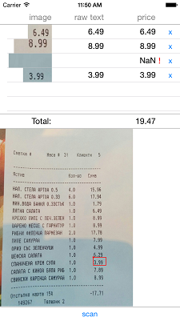

# NativeScript BillSplitter
The app uses the camera module to let you capture a photo of a bill. You can then mark some of the amounts in the bill and they get added in a list. OCR is used to convert the images into prices. The app also calculates the total amount of the selection.



# To start

## IOS
```
tns platform add ios
tns library add ios app/lib/TesseractOCR.framework
```
Tesseract requires language data files in order to initialize the engine. To setup Tesseract import your tessdata folder (located under ``` app/lib/testdata ``` ) into the root of your project AS A REFERENCED FOLDER.

## Android

```
tns platform add android
tns library add android \deps\tess-two
```

# To compile the TypeScript
To run TSC, first `npm install` then:
```
node_modules/typescript/bin/tsc -p ./app
```

TODO: Try if this is working:
```
node_modules/typescript/bin/tsc --watch -p ./app
```

> NOTE: Try if this will build and run:
```
node_modules/typescript/bin/tsc -p ./app && tns run ios --emulator --device iPhone-6
```

# To run
```
npm run ios
```
